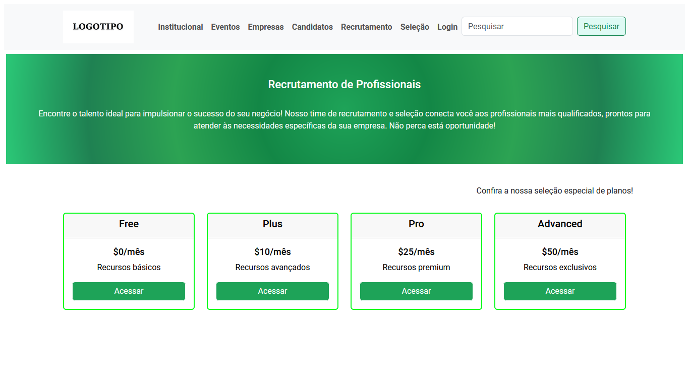

# 💳 Página de Precificação

Desafio técnico desenvolvido durante um processo seletivo, com foco na criação de uma interface de precificação responsiva e funcional.

🔗 **Acesse o projeto online:**  
https://pagina-precificacao.netlify.app/

---

## 🖼️ Preview

---

## 📌 Contexto do Projeto

Este projeto foi desenvolvido como parte de uma etapa técnica para Desenvolvedora Front-End.

O objetivo foi construir uma página de precificação com layout organizado, estrutura responsiva e interações utilizando JavaScript.

---

## 🛠️ Tecnologias Utilizadas

- HTML5  
- CSS3  
- Bootstrap  
- JavaScript  
- jQuery  

---

## ✨ Funcionalidades

- Estrutura organizada de planos de preços  
- Layout responsivo  
- Estilização com Bootstrap  
- Interações dinâmicas com JavaScript e jQuery  
- Interface clara e intuitiva  

---

## 🎯 Objetivos Técnicos

- Desenvolver layout fiel à proposta do desafio  
- Aplicar boas práticas de organização  
- Trabalhar responsividade  
---

## 💼 Competências Demonstradas

- Estruturação semântica com HTML  
- Estilização eficiente com Bootstrap  
- Implementação de interatividade com JavaScript
- Organização e clareza no código  

---

## 👩‍💻 Desenvolvedora

Wanessa Antonio  
